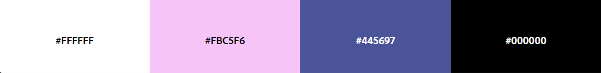

# FORMULAIRE

Réalisation d'une page web pour créer un formulaire d'inscription. L'objectif de ce projet était d'apprendre à utiliser les balises form.  
  
Charte graphique : 

Charte typographique :  
Monserrat sans-serif 16px.

[Lien vers le github du projet](https://bastienu.github.io/batmanBegins/)